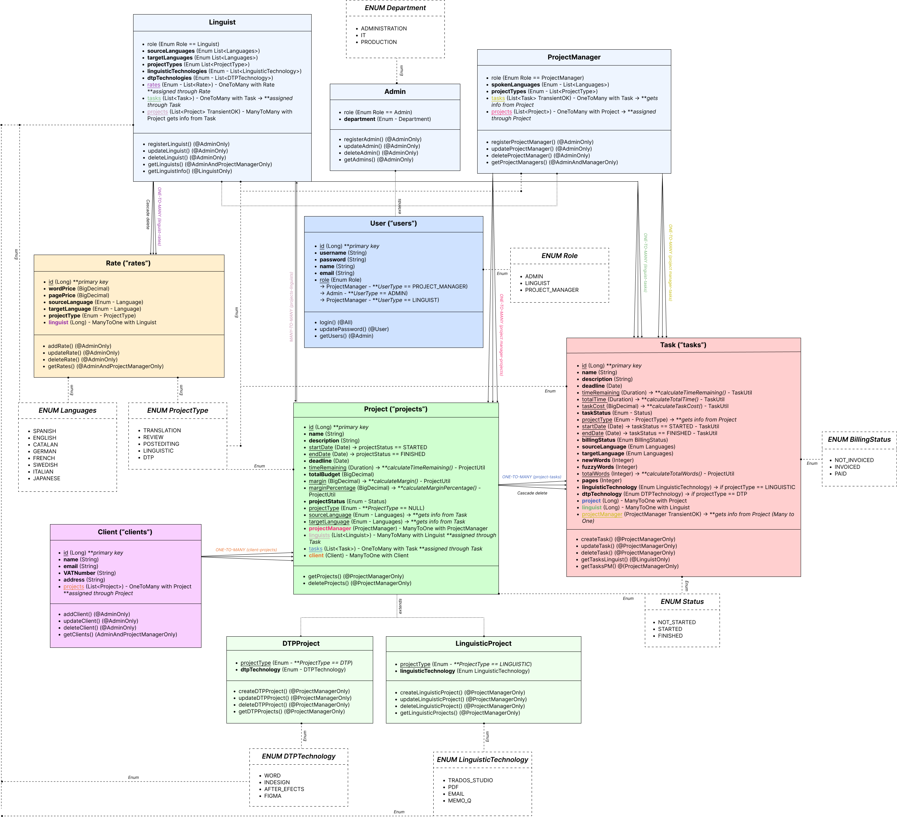

# Ironhack-JavaBack_finalProject

## Description of the project
This project is a **localization project management** system developed using Java and Spring Boot. The project is intended to showcase the skills and knowledge of the developer in implementing a backend system, utilizing MySQL database tables, and applying authentication with Spring Security. The main objective of this project is to provide a practical learning experience in developing a complex system while demonstrating proficiency in programming concepts such as error handling, unit testing, and integration. By completing this project, the developer aims to solidify their knowledge of Java Spring Boot, MySQL server management, and showcase their abilities in developing a robust and scalable system.

The aim of this project is to demonstrate that the localization project management systems currently available are not taking enough into account the perspective of the Project Manager, who is the most frequent user. Therefore, we have devised an API developed by Project Managers, taking into consideration the daily needs encountered by Project Managers.

---

## Class Diagram

---

## Setup

Here's a step-by-step guide to use the API by cloning the repository:

- Open a web browser and go to the GitHub repository for this API: https://github.com/annadpp/Ironhack-JavaBack_finalProject.
- Click on the green "Code" button and select "Download ZIP". This will download the -repository to your local machine. You can also clone it to your local machine.
- Extract the ZIP file to a folder on your local machine.
- Open the project in your preferred IDE.
- Configure the MySQL database using Workbench or your preferred MySQL client.
- Update the application.properties file with your MySQL database credentials.
- Build the project using Maven: `mvn clean install`.
- Run the application: `mvn spring-boot:run`.

---

## Technologies Used

The localization project management API is built using the following software, tools, and technologies:

- Java version 17
- Maven version 4.0.0
- Spring Boot version 3.2.5
- MySQL
- Lombok
- Jakarta Validation
- Spring Security
- JSON Web Token version 0.12.3
- JUnit (for testing) version 5.10.2

Note that these are the versions specified in the provided pom.xml file. Other versions may be compatible, but these are the ones that were used during development and testing of the application.

---

## Controllers and Routes structure

You will need to use an API development tool such as Postman, Insomnia or a similar application. These tools allow you to make HTTP requests to the application's endpoints, which in turn allows you to interact with the various features of the application. With these tools, you can test the functionality of the application, make requests to create, retrieve, update, and delete resources in the database, and ensure that the API is working as expected. In this way, you can use the API and make the most of its features.

### Authentication

| TITLE                | METHOD | PATH                                                                  | PARAMS                  | AUTH                    | ACCESS                 | BODY                                                                                                                                                                   |
|----------------------|--------|-----------------------------------------------------------------------|-------------------------|-------------------------|------------------------|------------------------------------------------------------------------------------------------------------------------------------------------------------------------|
| Login                | GET    | http://localhost:8080/auth/login?username={username}&password={password} | Username, Password      | None                    | ALL                    | None                                                                                                                                                                   |
| Register Admin       | POST   | http://localhost:8080/auth/register/admin                            | None                    | Required (Bearer Token) | ADMIN                  | {"username": "", "password": "", "name": "", "email": "", "department": ""}                                                                                         |
| Register Linguist    | POST   | http://localhost:8080/auth/register/linguist                         | None                    | Required (Bearer Token) | ADMIN                  | {"username": "", "password": "", "name": "", "email": "", "sourceLanguages": [], "targetLanguages": [], "projectTypes": [], "linguisticTechnologies": [], "dtpTechnologies": []} |
| Register Project Manager | POST | http://localhost:8080/auth/register/PM                               | None                    | Required (Bearer Token) | ADMIN                  | {"username": "", "password": "", "name": "", "email": "", "spokenLanguages": [], "projectTypes": []}                                                                 |
| Update password      | PUT    | http://localhost:8080/users/update/password                          | Id                      | Required (Bearer Token) | ALL (same user)        | {“password”: “”}                                                                                                                                                      |
#### Constraints:

- *Rates*, *tasks* and *projects* cannot be assigned directly from Linguist routes. *Rates*, *tasks* and *projects* related to the linguists are actually assigned from Rates, Tasks and Projects.
- *Role* is automatically assigned depending if you’re registering a Linguist, an Admin or a Project Manager.
- When registering a Linguist, if *projectTypes* is only DTP, *linguisticTechnology* must be null, and if *projectTypes* is not DTP only, *dtpTechnology* must be null.

### Users

| TITLE                   | METHOD | PATH                                          | PARAMS | AUTH                    | ACCESS                                   | BODY                             |
|-------------------------|--------|-----------------------------------------------|--------|-------------------------|------------------------------------------|----------------------------------|
| Update Admin            | PUT    | http://localhost:8080/admins/update          | Id     | Required (Bearer Token) | ADMIN                                    | Any of the Task updatable fields |
| Update Linguist         | PUT    | http://localhost:8080/linguists/update       | Id     | Required (Bearer Token) | ADMIN                                    | Any of the Task updatable fields |
| Update Project Manager  | PUT    | http://localhost:8080/project-managers/update | Id     | Required (Bearer Token) | ADMIN                                    | Any of the Task updatable fields |
| Delete Admin            | DELETE | http://localhost:8080/admins/delete          | Id     | Required (Bearer Token) | ADMIN                                    | None                             |
| Delete Linguist         | DELETE | http://localhost:8080/linguists/delete       | Id     | Required (Bearer Token) | ADMIN                                    | None                             |
| Delete Project Manager  | DELETE | http://localhost:8080/project-managers/delete | Id     | Required (Bearer Token) | ADMIN                                    | None                             |
| Access Users            | GET    | http://localhost:8080/users/get/**            | None/Depending on request | Required (Bearer Token) | ADMIN                                    | None                             |

#### Constraints:

- **Linguist**: *Rates*, *tasks* and *projects* cannot be assigned directly from Linguist routes. *Rates*, *tasks* and *projects* related to the linguists are actually assigned from Rates, Tasks and Projects.
- **ProjectManager**: *Tasks* and *projects* cannot be assigned directly from Linguist routes. *Tasks* and *projects* related to the linguists are actually assigned from Tasks and Projects.

### Rates

| TITLE                        | METHOD | PATH                                        | PARAMS                    | AUTH                    | ACCESS                           | BODY                                                                                      |
|------------------------------|--------|---------------------------------------------|---------------------------|-------------------------|----------------------------------|-------------------------------------------------------------------------------------------|
| Add Rate                     | POST   | http://localhost:8080/rates/save           | None/Depending on request | Required (Bearer Token) | ADMIN                            | {("wordPrice":  OR "pagePrice": ), "sourceLanguage": "", "targetLanguage": "", "projectType": "", "linguist": {"id": }} |
| Update Rate                  | PUT    | http://localhost:8080/rates/update         | Id                        | Required (Bearer Token) | ADMIN                            | Any of the Task updatable fields                                                          |
| Delete Rate                  | DELETE | http://localhost:8080/rates/delete         | Id                        | Required (Bearer Token) | ADMIN                            | None                                                                                      |
| Access Rates (PM & Admin)    | GET    | http://localhost:8080/rates/get/**         | None/Depending on request | Required (Bearer Token) | ADMIN & PROJECT_MANAGER****    | None                                                                                      |
| Access Rates (Linguist)      | GET    | http://localhost:8080/rates/get/**         | None/Depending on request | Required (Bearer Token) | LINGUIST (same user)           | None                                                                                      |

#### Constraints:

- If *projectType* !DTP, *pagePrice* must be null and if *projectType* is DTP, *wordPrice* must be null.
- *projectType* cannot be LINGUISTIC, only DTP, TRANSLATION, REVIEW or POSTEDITING.

### Clients

| TITLE          | METHOD | PATH                                    | PARAMS | AUTH                    | ACCESS                           | BODY                                       |
|----------------|--------|-----------------------------------------|--------|-------------------------|----------------------------------|--------------------------------------------|
| Add Client     | POST   | http://localhost:8080/clients/save      | None   | Required (Bearer Token) | ADMIN                            | {"name": "", "email": "", "vatNumber": "", "address": ""} |
| Update Client  | PUT    | http://localhost:8080/clients/update    | Id     | Required (Bearer Token) | ADMIN                            | Any of the Task updatable fields           |
| Delete Client  | DELETE | http://localhost:8080/clients/delete    |        | Required (Bearer Token) | ADMIN                            | None                                       |
| Access Clients | GET    | http://localhost:8080/clients/get/**    | None/Depending on request | Required (Bearer Token) | ADMIN & PROJECT_MANAGER          | None                                       |

#### Constraints:

- *projects* cannot be assigned directly from Client routes. Projects to which linguists are related are actually assigned from Projects.

### Projects

| TITLE                         | METHOD | PATH                                              | PARAMS                    | AUTH                    | ACCESS                                | BODY                                                                                                              |
|-------------------------------|--------|---------------------------------------------------|---------------------------|-------------------------|---------------------------------------|-------------------------------------------------------------------------------------------------------------------|
| Add DTP Project              | POST   | http://localhost:8080/dtp-projects/save          | None                      | Required (Bearer Token) | PROJECT_MANAGER                       | {"name": "", "description": "", "deadline": "", "totalBudget": , "projectStatus": "", "projectManager": {"id": }, "client":  {"id": }, "dtpTechnology": ""} |
| Add Linguistic Project      | POST   | http://localhost:8080/linguistic-projects/save  | None                      | Required (Bearer Token) | PROJECT_MANAGER                       | {"name": "", "description": "", "deadline": "", "totalBudget": , "projectStatus": "", "projectManager": {"id": }, "client":  {"id": }, "linguisticTechnology": ""} |
| Update DTP Project         | PUT    | http://localhost:8080/dtp-projects/update         | Id                        | Required (Bearer Token) | PROJECT_MANAGER                       | Any of the Task updatable fields                                                                               |
| Update Linguistic Project | PUT    | http://localhost:8080/linguistic-projects/update | Id                        | Required (Bearer Token) | PROJECT_MANAGER                       | Any of the Task updatable fields                                                                               |
| Delete Projects            | DELETE | http://localhost:8080/dtp-projects/delete        | Id                        | Required (Bearer Token) | PROJECT_MANAGER                       | None                                                                                                              |
| Delete DTP Project         | DELETE | http://localhost:8080/linguistic-projects/delete | Id                        | Required (Bearer Token) | PROJECT_MANAGER                       | None                                                                                                              |
| Delete Linguistic Project | DELETE | http://localhost:8080/dtp-projects/get/**        | Id                        | Required (Bearer Token) | PROJECT_MANAGER                       | None                                                                                                              |
| Access Projects            | GET    | http://localhost:8080/projects/get               | None                      | Required (Bearer Token) | ADMIN & PROJECT_MANAGER*****          | None                                                                                                              |
| Access DTP Projects        | GET    | http://localhost:8080/dtp-projects/get/**       | None/Depending on request | Required (Bearer Token) | PROJECT_MANAGER                       | None                                                                                                              |
| Access Linguistic Projects | GET    | http://localhost:8080/linguistic-projects/get/** | None/Depending on request | Required (Bearer Token) | PROJECT_MANAGER                       | None                                                                                                              |

#### Constraints:


- If *projectType* !DTP, *pagePrice* must be null and if *projectType* is DTP, *wordPrice* must be null.
- *projectType* can only be LINGUISTIC or DTP. This is assigned automatically when either creating a DTP or Linguistic Project.
- *startDate*, *endDate*, *timeRemaining*, *margin* and *marginPercentage* are calculated automatically and cannot be implemented manually. See utils.
- When deleting a project, all assigned tasks are deleted.

#### Utils:

- **updateProjectDates()**: sets *startDate* when *status* is STARTED, *endDate* when *status* is FINISHED and gets *startDate* back into null when *status* is NOT_STARTED (default).
- **updateTimeRemaining()**: sets *timeRemaining* when there is information logged in both *deadline* and *startDate*. It’s the difference between them two.
- **calculateMargin()**: sets *margin* by looping through *taskCost* of all tasks related to the project and substracting it to the *totalBudget*.
- **calculateMarginPercentage()**: sets *marginPercentage* providing the margin but in percentage form.

### Tasks

| TITLE                        | METHOD | PATH                                | PARAMS | AUTH                    | ACCESS                     | BODY                                                                                                       |
|------------------------------|--------|-------------------------------------|--------|-------------------------|----------------------------|------------------------------------------------------------------------------------------------------------|
| Add Task                     | POST   | http://localhost:8080/tasks/save   | Id     | Required (Bearer Token) | PROJECT_MANAGER            | {"name": "", "description": "", "deadline": "", "projectStatus": "", "billingStatus": "", "sourceLanguage": "", "targetLanguage": "", ("linguisticTechnology": "" OR "dtpTechnology": ""), "project": {"id": }, "linguist": {"id": }} |
| Update Task                  | PUT    | http://localhost:8080/tasks/update | Id     | Required (Bearer Token) | PROJECT_MANAGER            | Any of the Task updatable fields                                                                           |
| Delete Task                  | DELETE | http://localhost:8080/tasks/delete | Id     | Required (Bearer Token) | PROJECT_MANAGER            | None                                                                                                       |
| Access Tasks (PM & Admin)    | GET    | http://localhost:8080/tasks/get/PM | None   | Required (Bearer Token) | ADMIN & PROJECT_MANAGER*** | None                                                                                                       |
| Access Tasks (Linguist)      | GET    | http://localhost:8080/tasks/get/REVISAR | None | Required (Bearer Token) | LINGUIST (same user)      | None                                                                                                       |

#### Constraints:

- *startDate*, *endDate*, *timeRemaining*, *totalTime* and *taskCost* are calculated automatically and cannot be implemented manually. See utils.
- *projectManager* and *projectType* cannot be assigned directly from tasks routes. Tasks to which *projectManager* and *projectType* are related are actually assigned from Projects.
- If *projectType* !DTP, *pages* must be null and if *projectType* is DTP, *newWords* and *fuzzyWords* must be null.
- If *projectType* !DTP, *dtpTechnology* must be null and if *projectType* is DTP, *linguisticTechnology* must be null.
- *projectType* cannot be LINGUISTIC, only DTP, TRANSLATION, REVIEW or POSTEDITING.
- DTP tasks can only be assigned to DTP projects, and TRANSLATION, REVIEW or POSTEDITING tasks can only be assigned to LINGUISTIC projects.

#### Utils:

- **updateTaskDates()**: sets *startDate* when *status* is STARTED, *endDate* when *status* is FINISHED and gets *startDate* back into null when *status* is NOT_STARTED (default)
- **updateTotalTime()**: sets *totalTime* checking the difference between *startDate* and *deadline*.
- **updateTimeRemaining()**: sets *timeRemaining* when there is information logged in both *deadline* and *startDate*. It’s the difference between them two.
- **calculateTotalWords()**: sets *totalWords* by adding the task *newWords* and *fuzzyWords*.
- **calculateTaskCost()**: sets *taskCost* by checking *projectType*, getting the assigned linguist’s Rate by comparing task *sourceLanguage* and *targetLanguage* and rates *sourceLanguage* and *targetLanguage*, and multiplying the rate to be applied by the *totalWords* or *pages* of the task.

---

## Extra links

- [Trello (for work management)](https://trello.com/b/3P751pgH/final-project-ironhack)
- [Class diagram](https://www.figma.com/design/uOnYOiDwKgG9gTmUUjuAGA/Final-Project-Ironhack?t=SR8wkm8CCNpTTdqB-1)
- [Presentation slides](https://docs.google.com/presentation/d/1m3EbCYDpKV4QL0Lp3WMmAUn8y-FgvxlTq_mfYIcqig4/edit?usp=sharing)

---

## Future Work

- Invoicing features will be added to enable seamless financial management of the projects. More controllers and routes will be added as needed.
- Task/Client refactoring to make improvement and maintenance easier.
- Testing will be improved with further coverage.
- Also, a complete full-stack API will be built with Vue.js as front-end framework as part of the developer's future portfolio.

---

## Resources

---

## Team members

[Anna de Pablo Puig](https://es.linkedin.com/in/annadepablopuig/)

